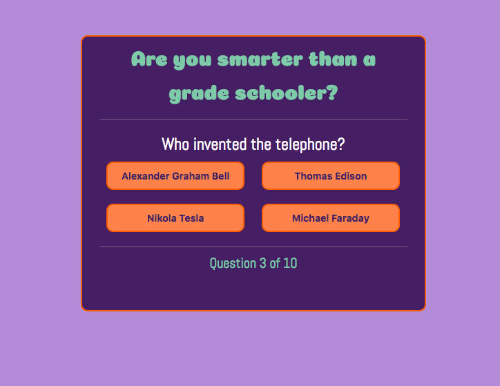
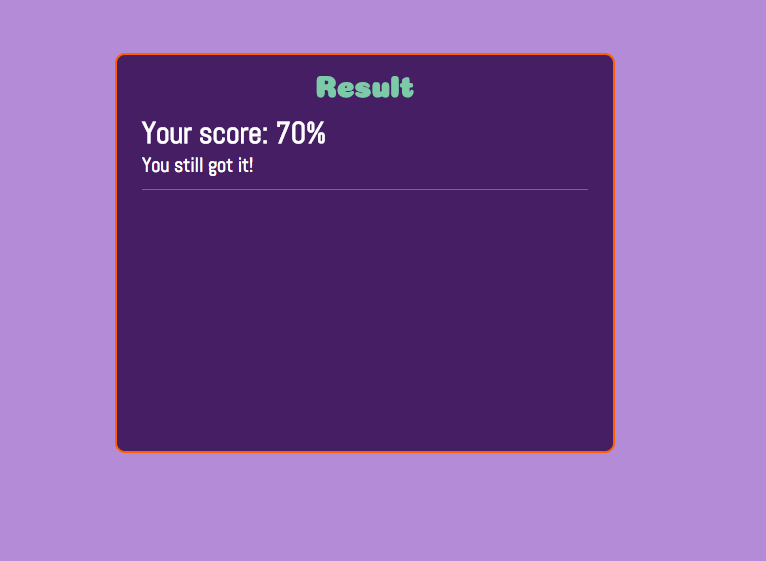

# Javascript Quiz-Game
Multiple choice quiz game



## Description

How's your grade school trivia? Take a gander at my app and see if you still have what
it takes to answer these ten questions on classroom subjects that stump even the brightest
students.

## Built With

* HTML
* CSS
* Javascript

## Installation

To run my application simply clone the project and run the html file.

## Usage

The object of the game it to get a passing grade of at least 70%. 



There will be four choices with each question. Select the correct answer to the best of your 
ability. As you progress through the quiz, a score will calculated in the background
ultimately resulting in a final score after the last question.

## License

```Groovy
MIT License

Copyright (c) 2018 Betu Kayembe

Permission is hereby granted, free of charge, to any person obtaining a copy
of this software and associated documentation files (the "Software"), to deal
in the Software without restriction, including without limitation the rights
to use, copy, modify, merge, publish, distribute, sublicense, and/or sell
copies of the Software, and to permit persons to whom the Software is
furnished to do so, subject to the following conditions:

The above copyright notice and this permission notice shall be included in all
copies or substantial portions of the Software.

THE SOFTWARE IS PROVIDED "AS IS", WITHOUT WARRANTY OF ANY KIND, EXPRESS OR
IMPLIED, INCLUDING BUT NOT LIMITED TO THE WARRANTIES OF MERCHANTABILITY,
FITNESS FOR A PARTICULAR PURPOSE AND NONINFRINGEMENT. IN NO EVENT SHALL THE
AUTHORS OR COPYRIGHT HOLDERS BE LIABLE FOR ANY CLAIM, DAMAGES OR OTHER
LIABILITY, WHETHER IN AN ACTION OF CONTRACT, TORT OR OTHERWISE, ARISING FROM,
OUT OF OR IN CONNECTION WITH THE SOFTWARE OR THE USE OR OTHER DEALINGS IN THE
SOFTWARE.
```
